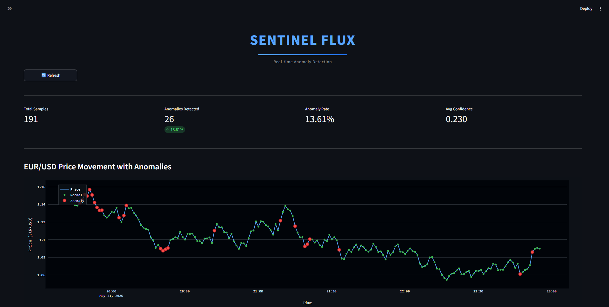
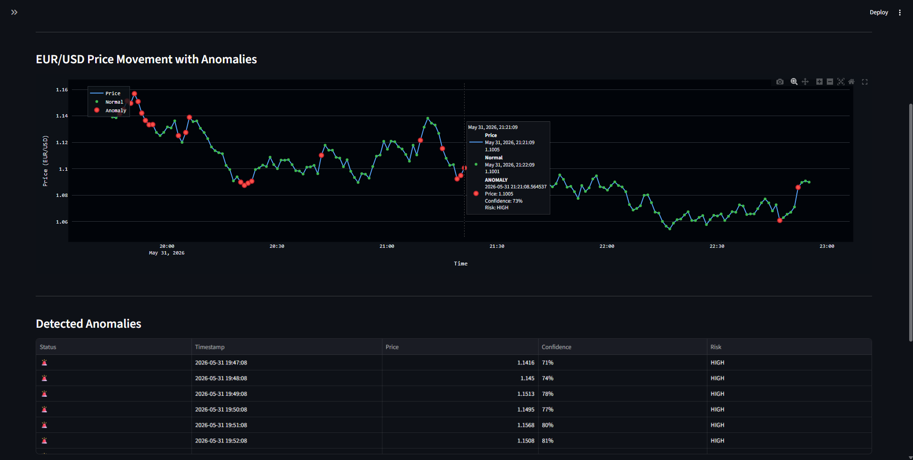
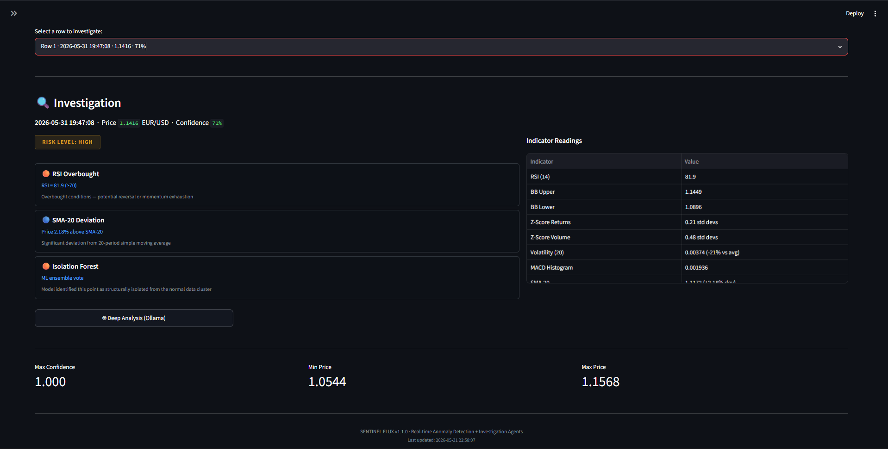
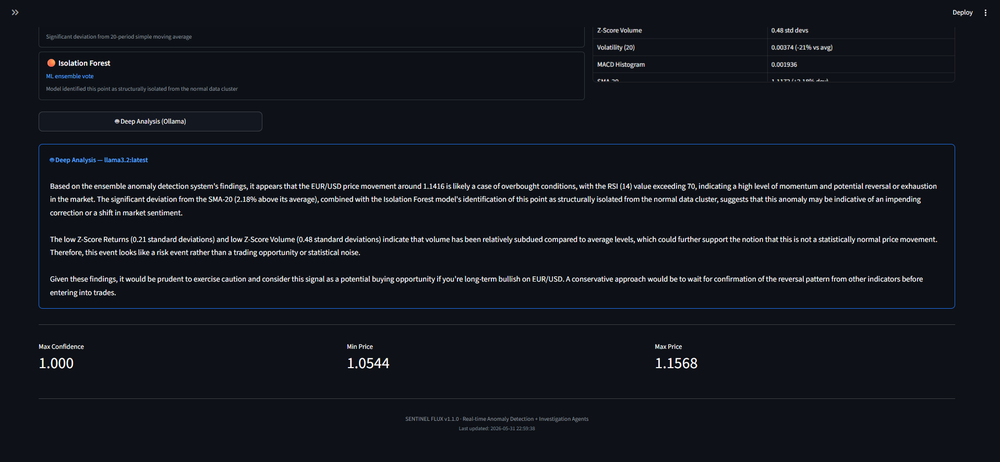

# SENTINEL FLUX

**Real-time anomaly detection system for EUR/USD forex data.**

Sentinel Flux ingests 1-minute OHLCV candlestick data, engineers 18 technical indicators, runs an ensemble ML model (Isolation Forest + Z-score voting), and surfaces anomalies through an interactive Streamlit dashboard with a two-stage investigation system — instant technical analysis followed by optional local LLM deep analysis via Ollama.

---

## Screenshots

### Dashboard Overview

*Header, live metrics (total samples, anomaly count, rate, avg confidence) and EUR/USD price chart with colour-coded normal (green) and anomaly (red) dots.*

### Anomaly Detection Table

*Scrollable table listing every detected anomaly with its timestamp, price, confidence percentage and risk classification. Select any row from the dropdown below to begin investigation.*

### Technical Investigation Panel

*Two-column investigation panel. Left: risk-level badge and individual trigger cards (RSI Overbought, BB Upper Band Breach, SMA-20 Deviation, Isolation Forest vote). Right: full indicator readings table.*

### Deep Analysis — Ollama LLM Output

*Prose market analysis generated by a locally running Ollama model (llama3.2:latest). No cloud API or subscription required.*

---

## Table of Contents

1. [System Architecture](#1-system-architecture)
2. [Project Structure](#2-project-structure)
3. [Tech Stack](#3-tech-stack)
4. [Data Ingestion](#4-data-ingestion)
5. [Feature Engineering](#5-feature-engineering)
6. [Anomaly Detection](#6-anomaly-detection)
7. [Investigation Agents](#7-investigation-agents)
8. [Dashboard](#8-dashboard)
9. [Installation](#9-installation)
10. [Running the Project](#10-running-the-project)
11. [Running Tests](#11-running-tests)
12. [Configuration Reference](#12-configuration-reference)
13. [Known Limitations](#13-known-limitations)

---

## 1. System Architecture

```
┌─────────────────────────────────────────────────────────────────┐
│                        DATA INGESTION                           │
│  Yahoo Finance API (EURUSD=X, 1-min OHLCV)                     │
│  └─ Fallback: Synthetic random-walk generator                   │
└────────────────────────┬────────────────────────────────────────┘
                         │ DataFrame [timestamp, open, high,
                         │            low, close, volume]
                         ▼
┌─────────────────────────────────────────────────────────────────┐
│                     FEATURE PIPELINE                            │
│  engineer_features()  → 18 technical indicators                 │
│  normalize_features() → StandardScaler (zero mean, unit var)    │
│  dropna()             → removes warm-up rows (first ~49)        │
└────────────────────────┬────────────────────────────────────────┘
                         │ ML-ready DataFrame (~191 rows)
                         ▼
┌─────────────────────────────────────────────────────────────────┐
│                    ANOMALY DETECTION                            │
│  Isolation Forest  (n_estimators=100, contamination=0.05)       │
│  Z-score threshold (threshold=2.5, any feature breach)          │
│  Ensemble voting   (1+ vote → anomaly label)                    │
│  Confidence score  (IF_score + Z_binary) / 2.0  ∈ [0, 1]       │
└────────────────────────┬────────────────────────────────────────┘
                         │ results [+ anomaly_score, + is_anomaly]
                         ▼
┌─────────────────────────────────────────────────────────────────┐
│                   STREAMLIT DASHBOARD                           │
│  Metrics · Price chart · Anomaly table                          │
│                         │                                       │
│              [Select row to investigate]                        │
│                         │                                       │
│           ┌─────────────┴──────────────┐                       │
│           │                            │                        │
│  Technical Analyzer             LLM Analyzer                    │
│  (instant, rule-based)      (Ollama, local LLM)                │
│  RSI · BB · Z-score         Prose market analysis               │
│  Volatility · MACD · SMA    4-6 sentences                      │
└─────────────────────────────────────────────────────────────────┘
```

**Data flow summary:** Raw OHLCV → 18 features → normalized → Isolation Forest + Z-score ensemble → anomaly labels + confidence scores → dashboard visualization → on-demand two-layer investigation.

---

## 2. Project Structure

```
sentinel-flux/
├── src/
│   ├── ingestion/
│   │   ├── __init__.py
│   │   └── data_fetcher.py          # YahooFinanceFetcher + synthetic fallback
│   ├── feature_pipeline/
│   │   ├── __init__.py
│   │   ├── indicators.py            # Pure functions: SMA, EMA, RSI, ATR, MACD, etc.
│   │   └── feature_engineer.py      # FeatureEngineer class + StandardScaler
│   ├── models/
│   │   ├── __init__.py
│   │   ├── anomaly_detector.py      # AnomalyDetector (IsolationForest + Z-score)
│   │   └── ensemble.py              # EnsembleManager (train / predict_batch / predict_realtime)
│   ├── agents/
│   │   ├── __init__.py
│   │   ├── technical_analyzer.py    # Rule-based indicator trigger analysis
│   │   └── llm_analyzer.py          # Ollama REST API client for deep analysis
│   ├── dashboard/
│   │   ├── __init__.py
│   │   └── app.py                   # Streamlit application (entry point)
│   ├── api/
│   │   └── __init__.py              # Reserved - FastAPI backend (not implemented)
│   └── storage/
│       └── __init__.py              # Reserved - database layer (not implemented)
├── tests/
│   ├── __init__.py
│   ├── unit/
│   │   ├── __init__.py
│   │   ├── test_data_fetcher.py
│   │   ├── test_feature_engineer.py
│   │   └── test_anomaly_detector.py
│   ├── integration/
│   │   └── __init__.py
│   └── performance/
│       └── __init__.py
├── docs/
│   └── ARCHITECTURE.md
├── config/
│   └── requirements.txt
├── .env.example
└── README.md
```

---

## 3. Tech Stack

| Layer | Library | Version | Purpose |
|---|---|---|---|
| Data fetching | yfinance | 0.2.32 | Yahoo Finance OHLCV download |
| Data processing | pandas | 2.1.3 | DataFrames, rolling windows |
| Numerical | numpy | 1.26.2 | Array operations, log returns |
| ML | scikit-learn | 1.3.2 | IsolationForest, StandardScaler |
| Dashboard | streamlit | 1.28.1 | Interactive web UI |
| Charts | plotly | 5.17.0 | Interactive price chart |
| LLM client | requests | 2.31.0 | Ollama REST API calls |
| LLM runtime | Ollama | any | Local model serving (e.g. llama3.2) |
| Testing | pytest | 7.4.3 | Unit test runner |
| Env vars | python-dotenv | 1.0.0 | `.env` file loading |

> **Deep Analysis requires no cloud API key.** Ollama runs models locally and is completely free.

---

## 4. Data Ingestion

**File:** `src/ingestion/data_fetcher.py`

### Class: `YahooFinanceFetcher`

Fetches EUR/USD OHLCV data from Yahoo Finance using the ticker symbol `EURUSD=X`. On any failure (rate limit, network error, empty response), automatically falls back to a synthetic data generator so the rest of the pipeline continues uninterrupted.

**Public method:** `fetch_latest(period, interval) -> pd.DataFrame`

Columns returned: `timestamp`, `open`, `high`, `low`, `close`, `volume`

### Period / Interval Mapping

Controlled by the `get_forex_data(days)` convenience function:

| `days` argument | yfinance period | Interval | Approx. rows |
|---|---|---|---|
| 1 | `1d` | `1m` | 240 |
| 2-5 | `5d` | `5m` | 288 |
| 6-30 | `1mo` | `1h` | ~160 |
| 31+ | `3mo` | `1d` | ~60 |

### Synthetic Data Generator

When the API is unavailable, `_generate_synthetic_data()` produces a realistic EUR/USD random walk:

| Parameter | Value |
|---|---|
| Base price | 1.0850 |
| Return distribution | Normal, μ=0.0001, σ=0.005 |
| Price path | `base_price × exp(cumsum(returns))` |
| High | `max(open, close) × (1 + abs(N(0, 0.002)))` |
| Low | `min(open, close) × (1 - abs(N(0, 0.002)))` |
| Volume | Uniform integer in [1,000,000 – 5,000,000] |
| Timestamps | Counted backwards from `datetime.now()` at the configured interval |

### Public API

```python
from src.ingestion.data_fetcher import get_forex_data

df = get_forex_data(symbol="EURUSD=X", days=1)
# Returns DataFrame: timestamp, open, high, low, close, volume
```

---

## 5. Feature Engineering

**Files:** `src/feature_pipeline/indicators.py`, `src/feature_pipeline/feature_engineer.py`

### Class: `FeatureEngineer`

Transforms raw OHLCV data into 18 ML-ready features, then applies `sklearn.preprocessing.StandardScaler` for normalization.

### Engineered Features

| # | Feature | Column | Formula / Parameters |
|---|---|---|---|
| 1 | Log returns | `returns` | `ln(close[t] / close[t-1])` |
| 2 | Log volume | `log_volume` | `ln(volume + 1)` |
| 3 | Simple MA 20 | `sma_20` | Rolling mean, window=20 |
| 4 | Simple MA 50 | `sma_50` | Rolling mean, window=50 |
| 5 | Exponential MA 20 | `ema_20` | EWM span=20, adjust=False |
| 6 | RSI | `rsi_14` | Wilder RSI, period=14, range [0-100] |
| 7 | Average True Range | `atr_14` | `max(H-L, |H-C_prev|, |L-C_prev|)`, period=14 |
| 8 | Rolling volatility | `volatility_20` | Rolling std of returns, window=20 |
| 9 | Z-score returns | `zscore_returns` | `(returns - rolling_mean) / rolling_std`, window=20 |
| 10 | Z-score volume | `zscore_volume` | `(log_volume - rolling_mean) / rolling_std`, window=20 |
| 11 | Bollinger upper | `bb_upper` | SMA(20) + 2 × rolling_std(20) |
| 12 | Bollinger lower | `bb_lower` | SMA(20) - 2 × rolling_std(20) |
| 13 | Bollinger position | `bb_position` | `(close - bb_lower) / (bb_upper - bb_lower)` |
| 14 | MACD line | `macd` | EMA(12) - EMA(26) |
| 15 | MACD signal | `macd_signal` | EMA(9) of MACD line |
| 16 | MACD histogram | `macd_hist` | `macd - macd_signal` |
| 17 | Price change % | `price_change_pct` | `pct_change(close) × 100` |
| 18 | High-low range % | `high_low_pct` | `(high - low) / low × 100` |

> **NaN warm-up:** SMA(50) requires 50 rows before producing valid output. After `normalize_features()` and `dropna()`, the first ~49 rows are removed, leaving ~191 ML-ready rows from 240 raw rows in a 1-day dataset.

### Pipeline Methods

```python
engineer = FeatureEngineer()

# Step-by-step (used by dashboard to preserve raw values)
df_raw     = engineer.engineer_features(df)            # compute all 18 features
df_norm    = engineer.normalize_features(df_raw, fit=True)  # fit StandardScaler, transform
df_ml      = df_norm.dropna()                          # drop remaining NaN rows
raw_for_ml = df_raw.loc[df_ml.index]                  # un-normalized, same rows as df_ml

# Or in one call
df_ml = engineer.prepare_for_ml(df, fit=True)
```

The `raw_for_ml` DataFrame is preserved alongside the normalized version because `TechnicalAnalyzer` requires un-normalized values (e.g. RSI in its natural [0-100] range) to apply meaningful threshold comparisons.

---

## 6. Anomaly Detection

**Files:** `src/models/anomaly_detector.py`, `src/models/ensemble.py`

### Ensemble Architecture

Two independent detectors vote on each data point. A single vote from either is sufficient to flag a point as an anomaly.

```
Input data point
    │
    ├─► Isolation Forest ──► IF binary label (1=anomaly, 0=normal)
    │                         IF score (normalized to [0, 1])
    │
    └─► Z-score check ─────► Z binary label (1 if any feature > threshold)

ensemble_votes = IF_binary + Z_binary
is_anomaly     = (ensemble_votes >= 1)
confidence     = (IF_score + Z_binary) / 2.0
```

### Isolation Forest Parameters

| Parameter | Value |
|---|---|
| `n_estimators` | 100 |
| `contamination` | 0.05 |
| `random_state` | 42 |

Raw scores from `score_samples()` are negated and min-max normalized to [0, 1]: `(raw - min) / (max - min)`.

### Z-score Threshold Detector

Flags a data point if **any** of its features exceeds the threshold in absolute value after column-wise standardization:

```
feature_zscores = abs((X - X.mean(axis=0)) / (X.std(axis=0) + 1e-8))
zscore_anomaly  = any(feature_zscores > 2.5, axis=1)
```

| Parameter | Value |
|---|---|
| `zscore_threshold` | 2.5 |

### Real-time Alert Threshold

For single-point inference via `predict_realtime()`:

| Parameter | Value |
|---|---|
| `confidence_threshold` | 0.65 |

### Class: `EnsembleManager`

High-level interface used by the dashboard.

```python
from src.models.ensemble import EnsembleManager

manager = EnsembleManager(contamination=0.05)
manager.train_on_history(df_ml)          # fit IsolationForest and select feature columns
results = manager.predict_batch(df_ml)   # returns df with added anomaly_score, is_anomaly
result  = manager.predict_realtime(row)  # dict: is_anomaly, confidence, alert, max_zscore
summary = manager.get_summary(results)   # dict: total_samples, anomalies_detected,
                                         #       anomaly_rate_pct, avg_confidence, max_confidence
```

### Class: `AnomalyDetector`

Lower-level class wrapped by `EnsembleManager`.

```python
from src.models.anomaly_detector import AnomalyDetector

detector = AnomalyDetector(
    contamination=0.05,
    zscore_threshold=2.5,
    random_state=42
)
detector.train(df, feature_cols)
scores, labels = detector.detect(df, feature_cols)
result = detector.detect_realtime(row, feature_cols, confidence_threshold=0.65)
```

---

## 7. Investigation Agents

**Files:** `src/agents/technical_analyzer.py`, `src/agents/llm_analyzer.py`

When a user selects an anomaly row from the dashboard table, two analysis layers are available:

### Layer 1 — Technical Analyzer

**Class:** `TechnicalAnalyzer`

Rule-based, instant, no external dependencies. Operates on un-normalized `raw_for_ml` feature values and evaluates deterministic threshold rules against each indicator.

#### Detection Rules

| Rule | Condition | Severity |
|---|---|---|
| RSI Overbought | `rsi_14 > 70` | HIGH |
| RSI Oversold | `rsi_14 < 30` | HIGH |
| BB Upper Band Breach | `close > bb_upper` | HIGH |
| BB Lower Band Breach | `close < bb_lower` | HIGH |
| Abnormal Return | `abs(zscore_returns) > 2.0` | HIGH; CRITICAL if `> 3.0` |
| Volume Anomaly | `abs(zscore_volume) > 2.0` | MEDIUM |
| Volatility Spike | `(vol - vol_mean) / vol_std > 1.5` | HIGH; CRITICAL if `> 2.5` |
| MACD Crossover | MACD histogram sign change vs. prior row | MEDIUM |
| SMA-20 Deviation | `abs(close - sma_20) / sma_20 > 0.15%` | LOW |
| Isolation Forest | Always present for confirmed anomalies | HIGH |

#### Risk Level Aggregation

| Condition | Assigned Risk |
|---|---|
| >= 1 CRITICAL trigger, or >= 3 HIGH triggers | CRITICAL |
| >= 2 HIGH triggers | HIGH |
| 1 HIGH trigger | MEDIUM |
| No HIGH or CRITICAL | LOW |

#### Return Structure

```python
{
    "triggers": [
        {
            "name": "RSI Oversold",
            "value": "RSI = 9.2 (<30)",
            "detail": "Oversold conditions — potential reversal or bounce",
            "severity": "HIGH"
        },
        ...
    ],
    "risk_level": "CRITICAL",
    "indicator_readings": {
        "RSI (14)": "9.2",
        "BB Upper": "1.0523",
        "BB Lower": "1.0461",
        "Z-Score Returns": "-1.52 std devs",
        "Volatility (20)": "0.00465 (-6% vs avg)",
        "MACD Histogram": "-0.004348",
        "SMA-20": "1.0772 (+3.50% dev)",
        "SMA-50": "1.0821",
        "ATR (14)": "0.008135"
    },
    "trigger_count": 3
}
```

`trigger_count` excludes the always-present Isolation Forest entry.

#### Usage

```python
from src.agents.technical_analyzer import TechnicalAnalyzer

analyzer = TechnicalAnalyzer()
analysis = analyzer.analyze(raw_row, raw_for_ml)
# raw_row    — pd.Series: un-normalized features for the selected anomaly
# raw_for_ml — pd.DataFrame: un-normalized features for all ML-ready rows
#              (used to compute dataset statistics, e.g. volatility mean/std)
```

---

### Layer 2 — LLM Analyzer

**Class:** `LLMAnalyzer`

Sends anomaly context and trigger findings to a locally running Ollama model via its HTTP REST API. Returns a 4-6 sentence prose market analysis written for an experienced algorithmic trader.

#### Ollama REST API Integration

| Endpoint | Method | Timeout | Purpose |
|---|---|---|---|
| `http://localhost:11434/` | GET | 3 s | Health / availability check |
| `http://localhost:11434/api/tags` | GET | 5 s | List pulled model names |
| `http://localhost:11434/api/chat` | POST | 120 s | Run inference |

Request body structure:

```json
{
    "model": "llama3.2",
    "messages": [
        {"role": "system", "content": "You are an expert forex market analyst..."},
        {"role": "user",   "content": "Timestamp: ...\nPrice: ...\nTriggers: ..."}
    ],
    "stream": false
}
```

#### Default Model

`llama3.2` (3B parameters, ~2 GB on disk). Any model visible in `list_models()` can be selected from the dashboard sidebar.

#### Errors

| Condition | Exception |
|---|---|
| Ollama process not running | `ConnectionError` |
| Request exceeds 120 s | `TimeoutError` |
| Non-200 HTTP response | `requests.HTTPError` (via `raise_for_status()`) |

#### Usage

```python
from src.agents.llm_analyzer import LLMAnalyzer

if LLMAnalyzer.is_available():
    models = LLMAnalyzer.list_models()        # e.g. ["llama3.2", "mistral"]
    llm = LLMAnalyzer(model="llama3.2")
    prose = llm.analyze(
        timestamp="2026-05-31 13:22:06",
        price=1.0395,
        confidence=0.98,
        indicator_readings=analysis["indicator_readings"],
        triggers=analysis["triggers"],
        risk_level="CRITICAL",
    )
```

---

## 8. Dashboard

**File:** `src/dashboard/app.py`

Built with Streamlit 1.28.1 and Plotly 5.17.0. Dark theme throughout.

### Data Caching

```python
@st.cache_data(ttl=300)
def load_data(): ...
```

Results are cached for 300 seconds. The Refresh button calls `st.cache_data.clear()` before rerunning, forcing a new data fetch and full pipeline re-execution.

### Layout

```
Sidebar
  Ollama status (running / not running)
  Model selector (populated from list_models())

Header: SENTINEL FLUX
[Refresh button]

Metrics row: Total Samples | Anomalies Detected | Anomaly Rate | Avg Confidence

Price chart (Plotly):
  Trace 0 — blue line  (#58a6ff)  : full price series
  Trace 1 — green dots (#3fb950)  : normal data points
  Trace 2 — red dots   (#f85149)  : anomaly data points
  Hover tooltip: timestamp, price, confidence, risk label

Anomaly table: Status | Timestamp | Price | Confidence | Risk
[Select a row to investigate ▼]

Investigation panel (visible when row selected):
  Summary line: timestamp · price · confidence
  Left column:  RISK LEVEL badge · trigger cards (icon, name, value, detail)
  Right column: Indicator Readings table
  [🤖 Deep Analysis (Ollama)]  [✕ Clear]
  Deep analysis prose output

Summary stats: Max Confidence | Min Price | Max Price
```

### Session State

| Key | Type | Lifetime | Purpose |
|---|---|---|---|
| `deep_{orig_idx}` | `str` | Session | Cached Ollama analysis per anomaly row |

Each anomaly has its own session state key (`orig_idx` is the DataFrame integer index). Switching to a different anomaly does not clear the previous analysis.

---

## 9. Installation

### Prerequisites

- Python 3.12+
- Windows, macOS, or Linux
- (Optional) [Ollama](https://ollama.ai) for Deep Analysis

### Steps

```bash
# 1. Clone
git clone https://github.com/Anshul4321/sentinel-flux.git
cd sentinel-flux

# 2. Create virtual environment
python -m venv venv

# Windows
.\venv\Scripts\Activate.ps1

# macOS / Linux
source venv/bin/activate

# 3. Install dependencies
pip install -r config/requirements.txt
```

### Ollama Setup (optional)

```bash
# Download installer from https://ollama.ai, then pull a model:

ollama pull llama3.2        # ~2 GB, 3B params — recommended quality/speed balance
# or
ollama pull llama3.2:1b     # ~700 MB, 1B params — faster download, lighter machine
```

Ollama starts automatically after installation and serves at `http://localhost:11434`.

---

## 10. Running the Project

```bash
# Activate virtual environment
.\venv\Scripts\Activate.ps1       # Windows
source venv/bin/activate           # macOS / Linux

# Launch dashboard
streamlit run src/dashboard/app.py
```

Dashboard opens at **http://localhost:8501**

### Workflow

| Step | Action |
|---|---|
| 1 | Dashboard loads, fetches data, trains model, renders chart |
| 2 | Hover red dots on chart for quick anomaly tooltip |
| 3 | Scan the Detected Anomalies table |
| 4 | Select a row from the dropdown to open the Investigation panel |
| 5 | Technical Analysis appears instantly — risk level, triggers, indicator readings |
| 6 | Click "🤖 Deep Analysis (Ollama)" for prose market explanation (requires Ollama) |
| 7 | Click "🔄 Refresh" to fetch fresh data and retrain |

---

## 11. Running Tests

```bash
# All unit tests
pytest tests/unit/ -v

# Single file
pytest tests/unit/test_anomaly_detector.py -v

# With coverage
pytest tests/unit/ --cov=src --cov-report=term-missing
```

### Test Files

| File | What is tested |
|---|---|
| `test_data_fetcher.py` | Fetcher initialization; OHLCV column presence; all close prices positive |
| `test_feature_engineer.py` | Feature column creation; normalized mean near zero; NaN-free ML output |
| `test_anomaly_detector.py` | Model training; batch predictions in [0,1]; real-time prediction schema; summary stats |

---

## 12. Configuration Reference

### Environment Variables

No required environment variables. Copy `.env.example` to `.env` if needed.

```
# .env.example
# Deep Analysis uses a local Ollama model — no API key needed.
# Install Ollama: https://ollama.ai
# Pull a model:  ollama pull llama3.2
```

### Adjustable Parameters

All parameters are constants in source code. To change them, edit the relevant file directly.

| Parameter | File | Default | Effect |
|---|---|---|---|
| `contamination` | `models/anomaly_detector.py` | `0.05` | Expected fraction of anomalies |
| `zscore_threshold` | `models/anomaly_detector.py` | `2.5` | Z-score cutoff for statistical detector |
| `n_estimators` | `models/anomaly_detector.py` | `100` | Number of Isolation Forest trees |
| `random_state` | `models/anomaly_detector.py` | `42` | Reproducibility seed |
| `confidence_threshold` | `models/anomaly_detector.py` | `0.65` | Minimum confidence to fire a real-time alert |
| `cache TTL` | `dashboard/app.py` | `300` s | Seconds before `load_data()` cache expires |
| `Ollama default model` | `agents/llm_analyzer.py` | `llama3.2` | Model used when none selected |
| `Ollama inference timeout` | `agents/llm_analyzer.py` | `120` s | Maximum wait for LLM response |

---

## 13. Known Limitations

**Yahoo Finance rate limiting.** The free Yahoo Finance API is frequently rate-limited for 1-minute forex data. The system falls back to synthetic data automatically, but results will not reflect live market prices.

**Synthetic data changes each session.** After a cache clear or server restart, the synthetic random walk produces a new price path. Anomaly patterns differ between sessions.

**No persistent storage.** All results live in memory for the duration of the Streamlit session. There is no database backend; predictions are lost on page refresh.

**FastAPI backend not implemented.** The `src/api/` directory is a placeholder. The dashboard calls the ML pipeline directly rather than through an API layer.

**Ollama analysis is session-only.** Deep analysis results are stored in `st.session_state` and are lost when the browser tab is closed or the Streamlit server restarts.

**Tested on Windows 11 only.** The project was developed and tested on Windows 11 with Python 3.12.3. Compatibility with macOS and Linux is expected but not verified.
